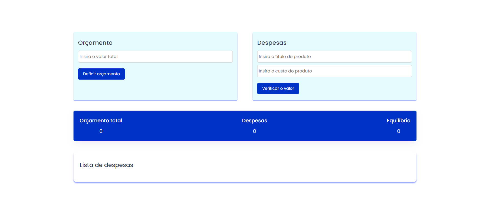

Budget-page - Página de orçamentos em JavaScript

&nbsp;
&nbsp;
&nbsp;

A Página de Orçamento é uma ferramenta simples e eficaz para gerenciar suas finanças pessoais. Desenvolvida com HTML, CSS e JavaScript, esta página permite que você defina um orçamento total e acompanhe suas despesas diárias de forma organizada e intuitiva.

<a href="https://pagebudget.netlify.app/" target="_blank"><strong>Demonstração ao vivo</strong></a>

 

Tecnologias utilizadas

HTML5, CSS3 e JavaScript: 

Utilizados para criar a estrutura, estilo e funcionalidade da página.

Font Awesome: 

Biblioteca de ícones utilizada para adicionar ícones visuais à interface.

Funcionalidades principais

Definir orçamento

Você pode inserir o valor total do seu orçamento na caixa de entrada correspondente e clicar no botão "Definir orçamento".
O valor do orçamento é exibido na seção de "Totalizando" e é usado para calcular o saldo restante.

Adicionar despesas

Para adicionar uma despesa, insira o título do produto e seu custo na seção "Despesas" e clique no botão "Verificar o valor".
As despesas adicionadas são exibidas na lista de despesas abaixo, com opções para editar ou excluir cada entrada.

Atualização automática

O saldo restante é atualizado automaticamente conforme você adiciona ou remove despesas.
Isso permite que você acompanhe facilmente quanto dinheiro ainda está disponível dentro do seu orçamento.

Responsividade e usabilidade

A Página de Orçamento foi projetada para ser responsiva e oferecer uma experiência de usuário consistente em dispositivos de diferentes tamanhos. Os elementos da página são organizados de forma clara e intuitiva, facilitando a visualização e interação em qualquer dispositivo.

Como utilizar

Para utilizar a Página de Orçamento, basta inserir o valor total do seu orçamento e começar a adicionar suas despesas. Você pode editar ou excluir despesas conforme necessário, e o saldo restante será atualizado automaticamente. Experimente também em dispositivos móveis para uma experiência completa!

 <b>Passo 1:</b> 
Insira um valor total e defina um orçamento

<b>Passo 2:</b> 
Insira um título para o produto

<b>Passo 3:</b> 
Insira o custo do produto

<b>Passo 4:</b> 
Clique em verificar valor

Os valores, títulos e preços dos produtos serão exibidos abaixo da lista de despesas.

 <b>Contato:</b>

Se você quiser entrar em contato comigo, sinta-se a vontade.
 

 
 

